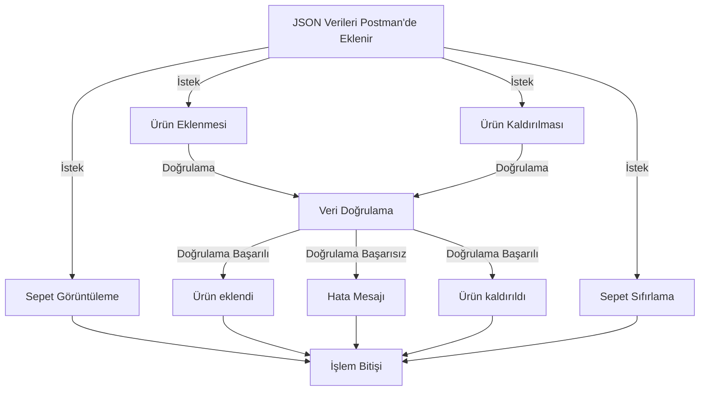

# Shopping Cart Application
This project includes a backend application that provides a shopping cart functionality. The app supports adding items to cart, removing items, fetching cart, and resetting cart using JSON data via Postman. It also includes the results of these operations and error management.

## Models and Rules

### Cart
- It is an object that contains all objects.
- All objects are applied to the Cart.
- There can be a maximum of **10 unique items** (not including VasItem) in a cart.
- The total number of products cannot be more than **30**.
- The total amount of the cart cannot be more than **500,000 ₺**.
### Item
- These are the products on the cart.
- Items can be added and removed from the cart.
- Cart items can be reset.
- Items can be of more than one type, such as VasItem, DefaultItem, DigitalItem.
- Item can be added in more than one quantity.
- The **maximum number** of items added is **10**.
- The price of each item is determined differently and given to the application as input.
- The items in the cart have seller and category IDs.
### Digital Item
- Only digital items can be added to a cart that has a DigitalItem.
- Digital item is a item such as steam card, donation card etc.
- The **maximum number** of DigitalItems can be added is **5**.
- Items with **CategoryID 7889** are defined as DigitalItem.
- **No other type of Item can be defined with this CategoryID**.
### VasItem
- Value Added Service item refers to services such as insurance and installation.
- These products do not represent a physical product but a service related to a certain product and **have no meaning on their own**.
- For this reason, it can only be added as a **sub-item to items** in the Furniture (CategoryID: 1001) and Electronics (CategoryID: 3004) categories.
- A **maximum of 3 VASItems** can be added to an Item.
- VasItem's **CategoryID is 3242**.
- The **seller ID of VasItems is 5003**.
- There is no other Item type with Seller ID 5003.
### Promotion
- An entity that applies discounts to certain items on the cart or to the entire cart.

## Paths

You can do actions by going to the following paths via the **Postman** application.

|         Action       |                        Path                               |
|----------------------|-----------------------------------------------------------|
| Add Item             |`http://localhost:8081/shopping-cart/add-item `            |
| Add VasItem          |`http://localhost:8081/shopping-cart/add-vas-item `        |
| Remove Item          |`http://localhost:8081/shopping-cart/remove-item`          |
| Remove VasItem       |`http://localhost:8081/shopping-cart/remove-vas-item`      |
| Reset Cart           |`http://localhost:8081/shopping-cart/get-shopping-cart `   |
| Display Cart         |`http://localhost:8081/shopping-cart/reset-shopping-cart`  |

> **ProTip:** It works on **port 8081**. You can make changes in the *ShoppingCartController.java* file for path and you can make change in the *application.properties* file for changing server port.


## Inputs and Outputs

Inputs and outputs of application are shown below.

|     Actions         |                                                Input                                                    |                           Output                            |
|---------------------|---------------------------------------------------------------------------------------------------------|-------------------------------------------------------------|
|Add Item             |`{ "itemId": int, "categoryId": int, "sellerId": int, "price": double, "quantity": int }`                |'{ "result":boolean, "message": string }'                    |
|Add vasitem to item  |`{"itemId": int, "vasItemId": int, "categoryId": int, "sellerId": int, "price": double, "quantity": int}`|{"result":boolean, "message": string}                        |
|Remove Item          |`{"itemId": int}`                                                                                        |'{ "result":boolean, "message": string }'                    |
|Reset Cart           |                                                                                                         |'{ "result":boolean, "message": string }'                    |
|Display Cart         |                                                                                                         |{"result":boolean, "message":{"items [ty.item], "totalPrice":double, "appliedPromotionId":int, "totalDiscount":double}} ty.item -> {itemId: int, categoryId: int, sellerId:int, price:double, quantity:int, "vasItems":[ty.vasItem]} ty.vasItem -> {"vasItemId":int, "categoryId": int, "sellerId":int, "price":double, "quantity":int}|


## Flow Chart of Application

You can see the flowchart of application below.




## Installation

### Requirements
-  [Java (Version: 21)](https://www.oracle.com/tr/java/technologies/downloads/)
-  [Maven](https://maven.apache.org/download.cgi)
-  [Docker ](https://www.docker.com/products/docker-desktop/)
- Spring Boot (Version: 3.1.4)
- Spring Boot Starter Web: (Version: 3.1.4)
- Project Lombok (Version: 1.18.30)
- MapStruct (Version: 1.5.5.Final)

### Installation

####  Download and build the project
Clone the project:
```bash
  git clone https://github.com/onaranyusuf/trendyol-backend-bootcamp-final-case.git
```
Go to project path:

```bash
  cd shopping-cart
```

Run the docker:

```bash
  docker-compose up
```

Run the Spring Boot application:
```bash
  mvn spring-boot:run
```

####  Tests

For run the rest run this command

```bash
  mvn test
```
## Author

**Yusuf Onaran**
* Github: [@onaranyusuf](https://github.com/onaranyusuf)
* LinkedIn: [@Yusuf Onaran](https://www.linkedin.com/in/yusufonaran/)
